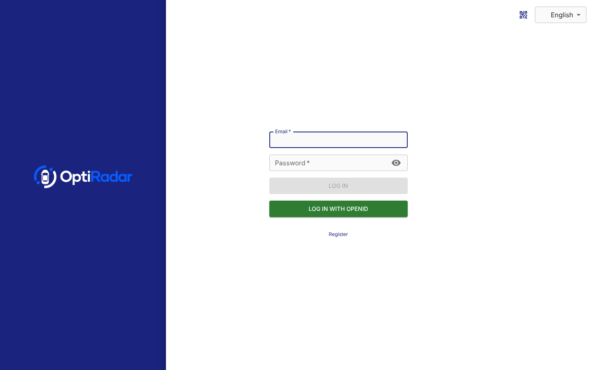

# OptiRadar

## Overview

OptiRadar is the connected vehicle tracking platform of the Opti product family. This repository contains the
Java-based back-end server, which supports more than 200 GPS protocols and 2000+ models of GPS tracking devices out
of the box, works with any major SQL database and provides a REST and WebSocket API (`openapi.yaml`).

| Sign-in page |
|---|
|  |

Other parts of OptiRadar:

- [OptiRadar web app](https://github.com/gsiddik/OptiRadar-web) - the browser-based tracking dashboard

## OptiNexus integration

OptiRadar signs users in through OptiNexus (OpenID Connect, one device group per tenant), takes part in central
logout and automatic deactivation, and reports device and geofence events to OptiNexus. OptiFleet receives odometer
readings from OptiRadar through the OptiNexus API Gateway. Setup and behavior: [docs/optinexus-sso.md](docs/optinexus-sso.md),
sample configuration: `setup/optiradar-optinexus.xml`.

## Quick Start

Build the image from `docker/` (or run the release workflow, which publishes `ghcr.io/<owner>/optiradar`), then run
it with a production-grade database using one of the Docker Compose samples:

```shell
docker compose -f docker/compose/optiradar-mysql.yaml up -d
```

OptiRadar will be available on port `8082`.

## Build

```shell
./gradlew assemble
```

This builds `target/tracker-server.jar` and its libraries in `target/lib`. Start it with
`java -jar target/tracker-server.jar setup/optiradar.xml`. The web app is built from the OptiRadar-web repository
and served from the folder in `web.path`.

## Features

- Real-time GPS tracking
- Driver behaviour monitoring
- Detailed and summary reports
- Geofencing functionality
- Alarms and notifications
- Account and device management
- Email and SMS support

## Naming

The product, installers, service, configuration file and Docker image are called OptiRadar. A few identifiers keep the
upstream name on purpose, because renaming them would break existing code, data or third-party services: the Java
package `org.traccar`, the `tc_` database table prefix, the `traccar` notificator and map matcher types and the
`notificator.traccar.key` setting (they refer to the Traccar cloud services at traccar.org), and the default AMQP
exchange name `traccar` used by forwarding.

## Credits and license

OptiRadar is based on the open source [Traccar](https://github.com/traccar/traccar) server by Anton Tananaev and
Andrey Kunitsyn. It is distributed under the Apache License, Version 2.0; see [LICENSE.txt](LICENSE.txt).
